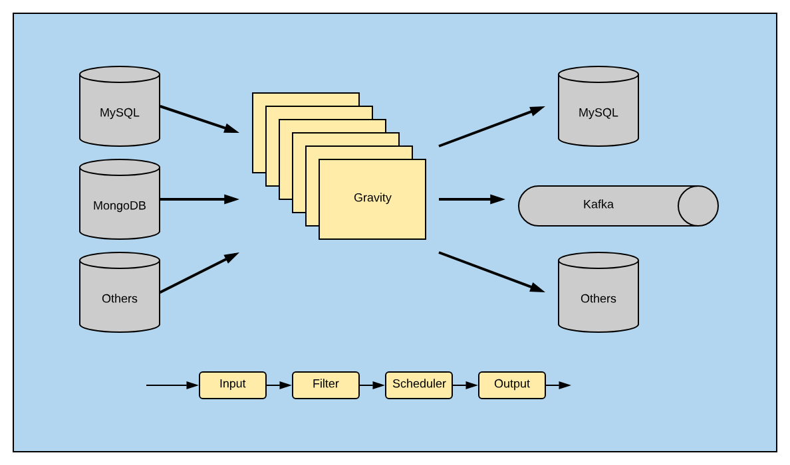

# **Gravity** [简体中文](./README-cn.md)
-------------------------

**Gravity** is used to replicate data between various inputs and outputs (databases, message queues).

It is designed to be a customizable data replication tool that:

- Supports multiple sources and destinations

- Supports Kubernetes-based replication cluster

## Use Cases

- Data Bus: Use Change Data Capture (MySQL binlog, MongoDB Oplog) and batch table scan to publish data to message queue like Kafka.
- Unidirectional data replication: Replicates data from one MySQL cluster to another MySQL cluster.
- Bidirectional data replication: Replicates data between two MySQL clusters bidirectionally.
- Synchronization of shards to the merged table: Synchronizes MySQL sharded tables to the merged table. You can specify the corresponding relationship between the source table and the target table.
- Online data mutation: Data can be changed during the replication. For example, rename the column, encrypt/decrypt data columns. 
## Features

### Input support

| Input | Status  |
|---|---|
|  MySQL Binlog | ✅  | 
|  MySQL Scan |  ✅ |   
|  Mongo Oplog | ✅  | 
|  TiDB Binlog | Doing  |
|  PostgreSQL WAL | Doing  |

### output support

| Output | Status  |
|---|---|
|  MySQL/TiDB | ✅  | 
|  Kafka |  ✅ |   

### Data mutation support

**Gravity** supports the following data mutations:

- Ignore specific data
- Renaming columns
- Deleting columns

### Documentation

- [Architecture](docs/2.0/00-arch-en.md)
- [Quick Start](docs/2.0/01-quick-start-en.md)
- [Configuration](docs/2.0/02-config-index-en.md)
- [Cluster Deployment](https://github.com/moiot/**Gravity**-operator)

-----------

Special thanks to [@dantin](https://github.com/dantin), [@LiangShang](https://github.com/liangshang), and [@liwink](https://github.com/liwink) for the early support to this project, and thanks [@CaitinChen](https://github.com/CaitinChen) for the initial translation of the documentation.