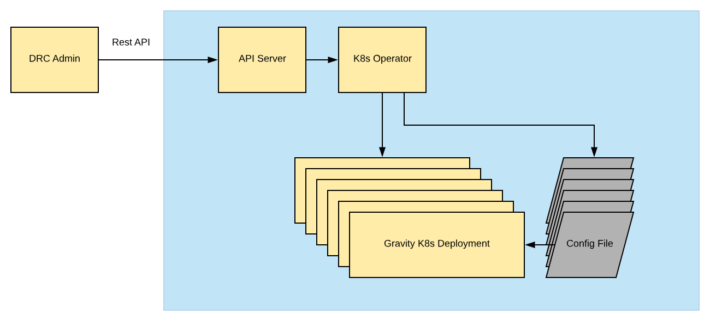

# DRC Architecture

DRC has two versions:

- DRC Single Process
- DRC Cluster

This document introduces the architectures of DRC Single Process and DRC Cluster respectively.

## DRC Single Process architecture

DRC Single Process uses the microkernel architecture based on plugins. The data input and output process is implemented by plugin-enclosed `core.Msg`. Each plugin has a separate configuration item.


DRC Single process consists of the following types of plugins:

- **Input**

    It adapts various data sources. For example, it adapts MySQL binlog files and generates `core.Msg`.

- **Filter**

    It mutates the data flow generated by Input, like filtering some data, renaming some columns and encrypting columns.

- **Output**

    It writes data to the target, like Kafka and MySQL. During this process, the routing rules defined by **Router** are used.

- **Scheduler**

    It schedules the data flow generated by Input and writes the data to the target by Output. It defines the data consistency feature the current system supports (Scheduler supports modifying the data in the same row in order by default).

- **Matcher**

    It matches the data generated by Input. **Filter** and **Router** use **Matcher** to match data.


You can develop plugins of the above types for your specific requirements.

The `core.Msg` definition is as follows:

```golang

type DDLMsg struct {
	Statement string
}

type DMLMsg struct {
	Operation DMLOp
	Data      map[string]interface{}
	Old       map[string]interface{}
	Pks       map[string]interface{}
	PkColumns []string
}

type Msg struct {
	Type      MsgType
	Host      string
	Database  string
	Table     string
	Timestamp time.Time

	DdlMsg *DDLMsg
	DmlMsg *DMLMsg
	...
}
```

## DRC Cluster architecture

DRC Cluster supports cluster deployment on Kubernetes natively.



DRC Cluster provides the Rest API to create the data synchronization task to report the task status. It manages each DRC task in the Web interface (DRC Admin).
